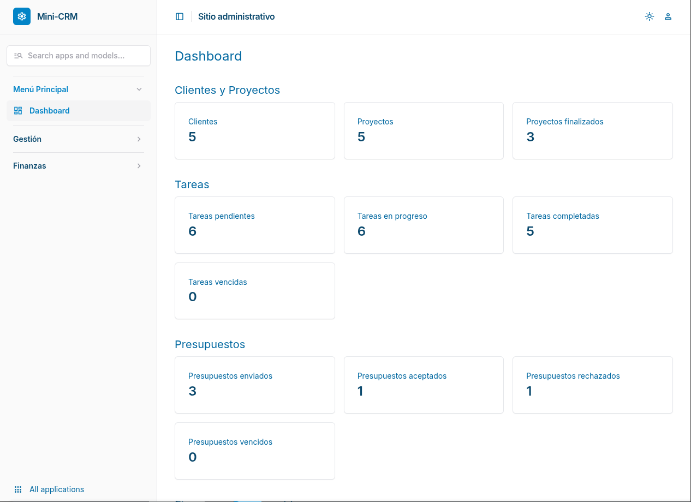
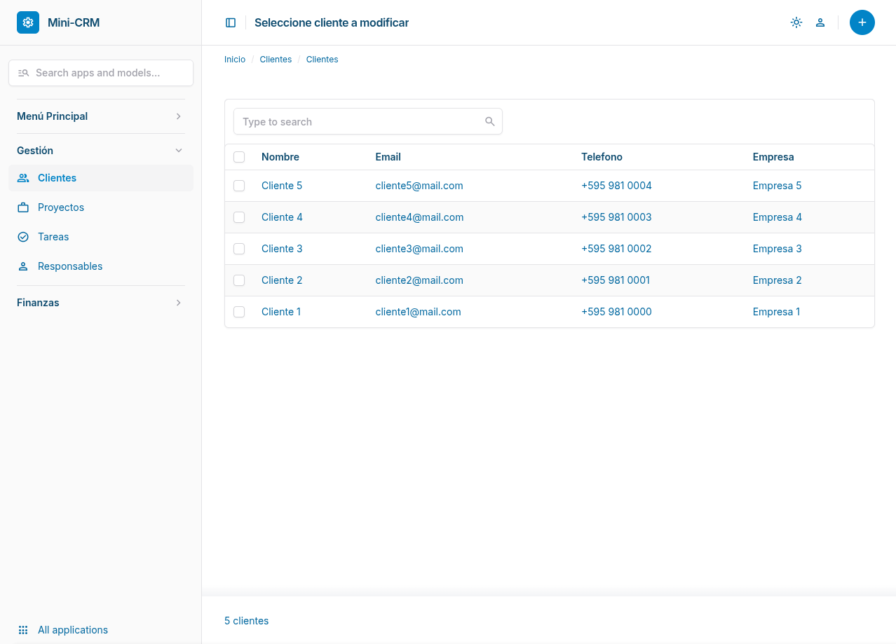
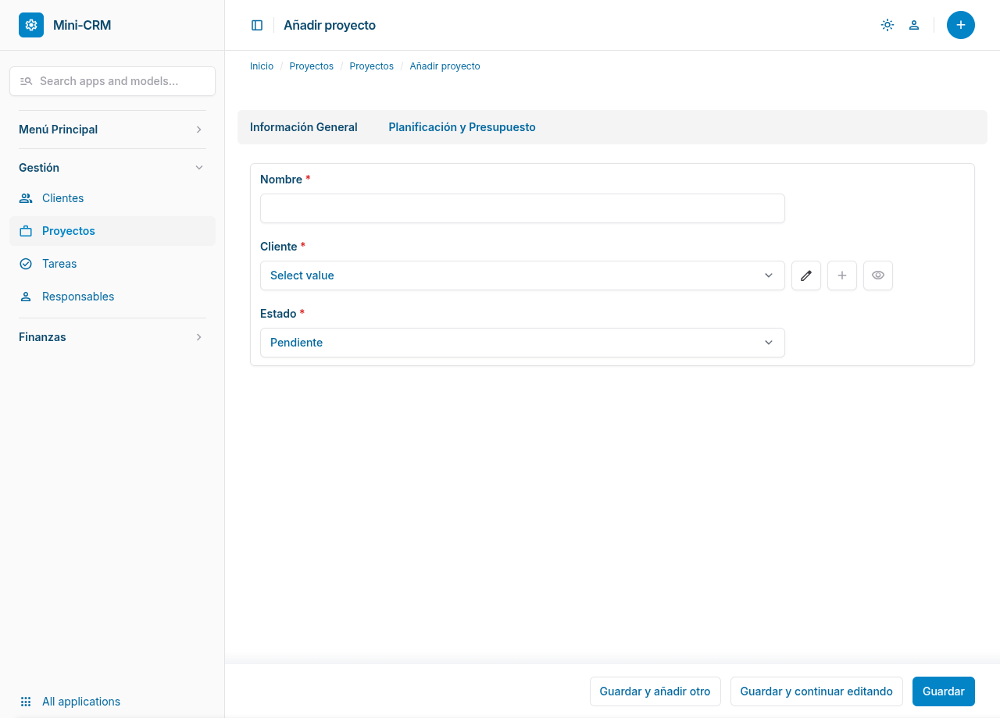
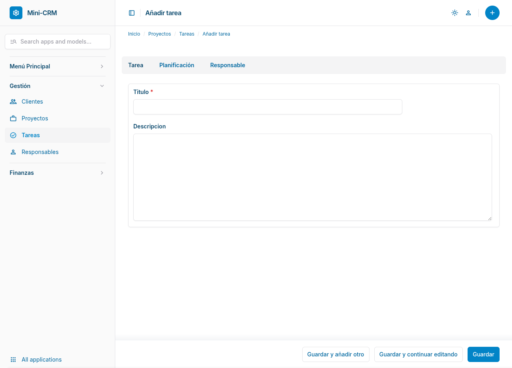
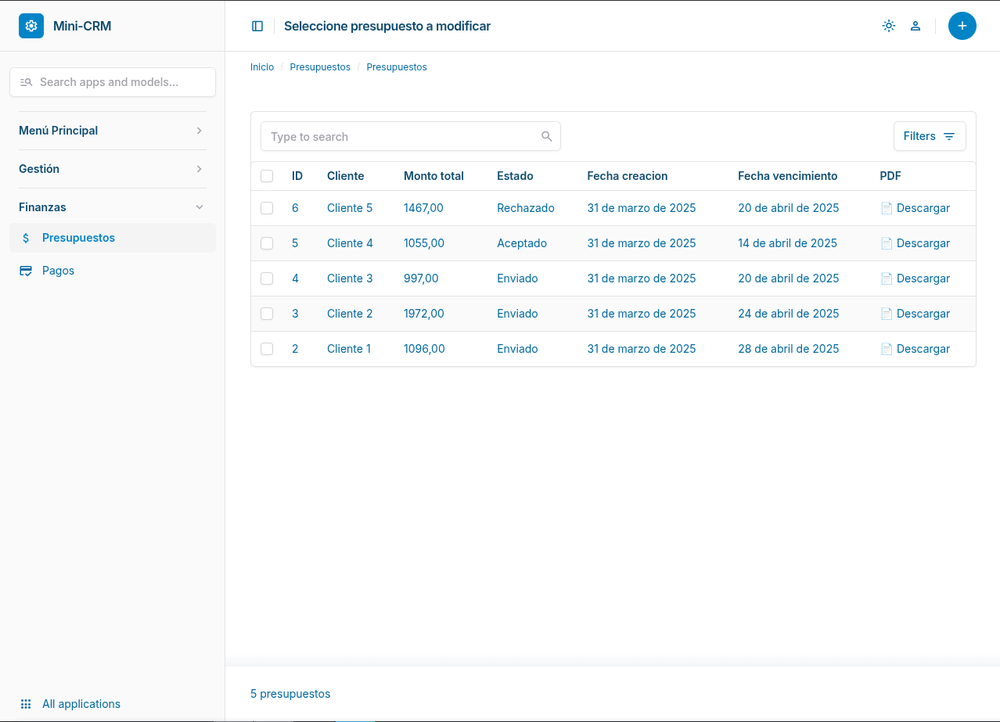
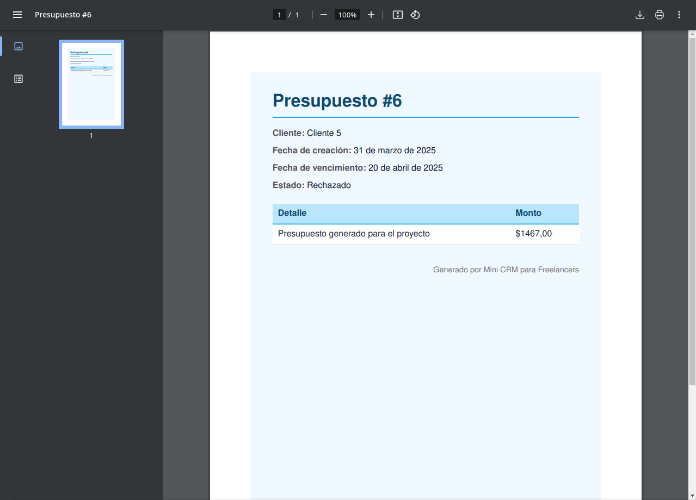

# 🧾 Mini CRM para Freelancers

**Mini CRM para Freelancers** es una aplicación web simple pero poderosa para gestionar clientes, proyectos, presupuestos, tareas y pagos.  
Ideal para profesionales independientes que buscan mantener sus relaciones y flujos de trabajo organizados, o como base para desarrolladores que quieran extenderla.

---

## 🎯 Objetivo

Brindar una herramienta organizada y estética donde freelancers puedan:

- Registrar clientes y proyectos
- Generar y gestionar presupuestos
- Registrar tareas y responsables
- Llevar un control básico de pagos
- Visualizar métricas desde el dashboard

---

## 🛠️ Stack

- **Backend:** Django 5 + Django Admin + Unfold
- **Base de datos:** SQLite (modo local)
- **Estética:** [Unfold](https://github.com/unfoldadmin/django-unfold) para un panel moderno sin escribir CSS
- **PDFs:** Exportación de presupuestos con WeasyPrint

---

## 🧩 Módulos incluidos

### 🔹 Clientes
- Nombre, email, teléfono, empresa, notas
- Relación con proyectos y presupuestos

### 🔹 Proyectos
- Cliente asociado, fechas de inicio y fin, descripción
- Estado del proyecto (pendiente, en progreso, finalizado)
- Presupuesto relacionado

### 🔹 Presupuestos
- Monto total, fechas, estado (enviado, aceptado, rechazado)
- PDF descargable desde el admin

### 🔹 Tareas
- Relacionadas a proyectos
- Prioridad, estado, fecha límite
- Responsable asignado

### 🔹 Pagos
- Monto, fecha, método
- Relacionados a presupuestos

---

## 📊 Dashboard

El panel principal incluye métricas clave:

- Total de clientes, proyectos y tareas
- Estados de presupuestos y tareas
- Monto total presupuestado vs. pagado

---

## 🚀 Instalación

### 1. Clonar el proyecto

```bash
git clone https://github.com/MatiasRojas-ay/mini-crm.git
cd mini-crm
```

### 2. Clonar el proyecto

```bash
python -m venv venv
source venv/bin/activate
```

### 3. Instalar dependencias

```bash
pip install -r requirements.txt
```

### 4. Crear el archivo .env

```env
SECRET_KEY=django-insecure-tu-clave-aqui
```
También podés copiar desde .env.example.

### 5. Migrar la base de datos y crear superusuario

```bash
python backend/manage.py migrate
python backend/manage.py createsuperuser
```

### 6. Ejecutar el servidor

```bash
python backend/manage.py runserver
```

Ir a: http://localhost:8000/admin/


## 🧪 Datos de prueba

Podés cargar datos ficticios ejecutando el script:

```bash
python backend/datos_prueba.py
```

### Dashboard



### Listado de clientes



### Detalle de Proyecto con Tabs



### Formulario de Tareas



### Presupuestos con botón PDF



### PDF generado con WeasyPrint



## 📁 Estructura del proyecto

```bash
mini-crm/
├── backend/           # Proyecto Django
│   ├── clientes/
│   ├── proyectos/
│   ├── presupuestos/
│   ├── mini_crm/      # Settings, urls, admin
│   ├── manage.py
├── templates/
│   └── admin/index.html  # Dashboard personalizado
├── requirements.txt
├── .env.example
└── README.md

```

## ✨ Autor

Desarrollado por [Matías Rojas]